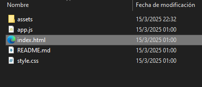
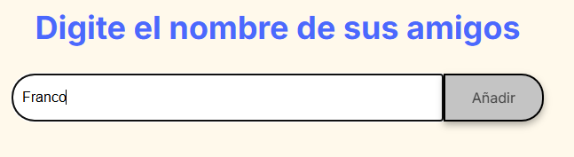
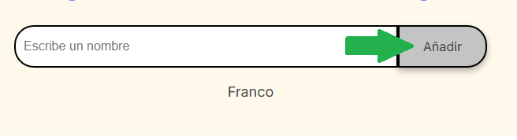
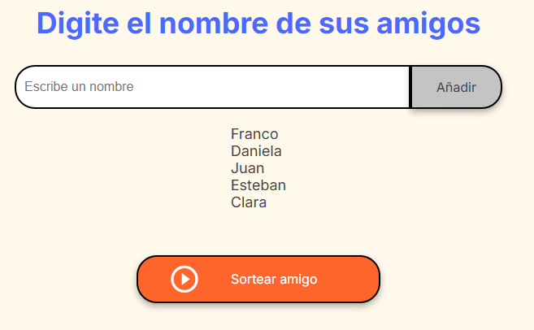
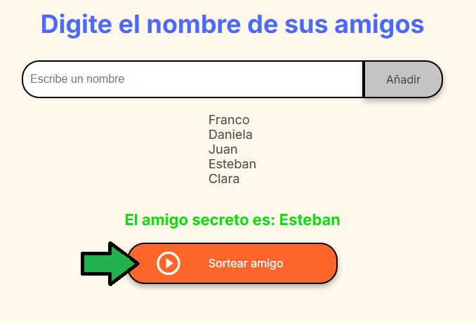

# Amigo Secreto

## Descripción del proyecto
"Amigo Secreto" es una aplicación web que permite a los usuarios ingresar nombres de amigos, y luego realizar un sorteo aleatorio para determinar quién será el "amigo secreto". Es perfecta para organizar dinámicas de intercambio de regalos de manera sencilla.

---

## Funcionalidades
- **Agregar amigos**: Permite ingresar nombres en una lista visible.
- **Validar entradas**: Asegura que el campo de texto no esté vacío y evita nombres duplicados.
- **Sorteo aleatorio**: Selecciona un nombre de forma aleatoria entre los ingresados.
- **Interfaz simple y amigable**.

---

## Instalación desde GitBash
1. Clona este repositorio en tu máquina local:
    ```bash
   git clone https://github.com/FrancoAr25/Amigo-Secreto.git
   ```
---

## Instrucciones

Una vez descargado el repositorio en tu computador, ejecuta el archivo "index.html".



Escribe el nombre de un amigo en el campo de texto.



Haz clic en "Añadir" para agregarlo a la lista.



Una vez que todos los nombres estén añadidos, haz clic en "Sortear Amigo" para realizar el sorteo.



El nombre seleccionado aparecerá como resultado en la pantalla.




## Dependencias
- HTML
- CSS
- JavaScript

## Autor y Agradecimientos

- **Autor**: Franco
- **GitHub**: [FrancoAr25](https://github.com/FrancoAr25)
- **Email**: tapamartinez@gmail.com

Agradecimientos especiales al **Equipo Alura Latam** por el aprendizaje y el apoyo.
